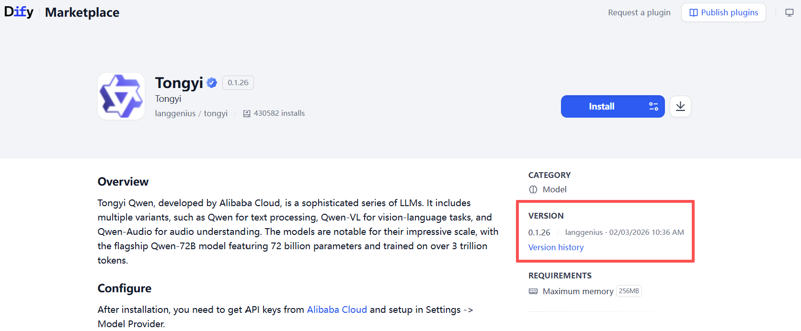

## Quick start
Conda virtual environments offer a light and flexible setup. For different projects, we recommend using separate conda environments for management.

```bash
conda create -n chat2workflow python=3.10
conda activate chat2workflow
pip install -r requirements.txt
```

> Before installing Dify, make sure your machine meets the following minimum system requirements:
>
> - CPU >= 2 Core
> - RAM >= 4 GiB

</br>

Obtain the specified version of dify:

`git clone https://github.com/langgenius/dify.git --branch 1.9.2 --depth 1`

The easiest way to start the Dify server is through [Docker Compose]. Before running Dify with the following commands, make sure that [Docker] and [Docker Compose] are installed on your machine:

```bash
cd dify
cd docker
cp .env.example .env
docker compose up -d
```

After running, you can access the Dify dashboard in your browser at http://localhost/install and start the initialization process.

Setting up an admin account. Also fill the following information into `config.yaml`.
> - email_address
> - user_name
> - password

</br>

Install the following specified version plugins in [Plugins]-[MarketPlace]:
> - langgenius/tongyi:0.1.13 (API Key Authorization Configuration in [Settings]-[WORKSPACE]-[Model Provider])
> - langgenius/openai:0.2.7 (API Key Authorization Configuration in [Settings]-[WORKSPACE]-[Model Provider])
> - wwwzhouhui/qwen_text2image:0.0.3 (API Key Authorization Configuration in [Plugins])
> - langgenius/google:0.0.9 (API Key Authorization Configuration in [Plugins])
> - bowenliang123/md_exporter:2.2.0
> - hjlarry/mermaid_converter:0.0.1
> - langgenius/echarts:0.0.1

</br>



Fill in the information in the `config.yaml`.

```yaml
# Github REST API for higher rate limits
github_rest_token: "github_xxx" # null or "github_xxx"

# Your admin account
user: "xxx"
admin_email: "xxx@yyy.com"
admin_password: "xxxxx"

# LLM API for workflow generation and evaluation
llm_api_key: "sk-xxxxxx"
base_url: "xxxxx"
evaluation_model: deepseek-chat
```

Modify the `model_name` and then execute the script sequentially.:
```bash
bash bash_generation.sh    # Generate LLM response
bash bash_pass_stage.sh    # The pass stage of the evaluation
bash bash_resolve_stage.sh    # The resolve stage of the evaluation
```
