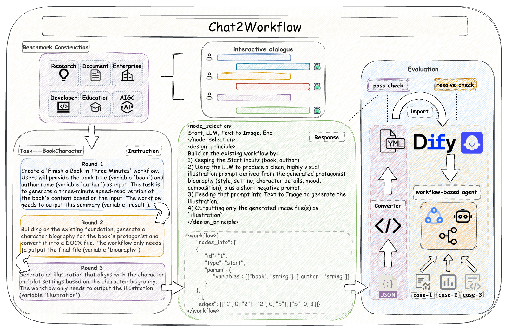
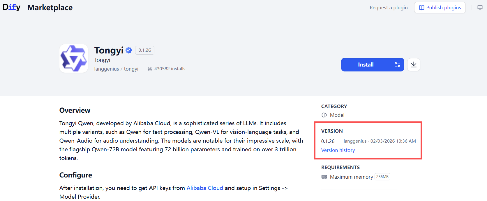

<h1 align="center"> Chat2Workflow </h1>

<div align="center">

[](https://github.com/zjunlp/Chat2Workflow) 
[](https://opensource.org/licenses/Apache-2.0)
[](https://arxiv.org/abs/2604.19667)
[](https://huggingface.co/papers/2604.19667)
 

</div>

## Table of Contents
- 🔔 [News](#news)
- 👀 [Overview](#overview)
- 📁 [Directory](#directory)
- 🔧 [Installation](#installation)
- 🧐 [Evaluation](#evaluation)
- 💻 [Generation](#generation)
- ⚙️ [Conversion](#conversion)

---

## 🔔 News

- **[2026-04]** We release a new paper: "[Chat2Workflow: A Benchmark for Generating Executable Visual Workflows with Natural Language](https://arxiv.org/abs/2604.19667)".


## 👀Overview
### Demostration


### Benchmark


## 📁Directory
| Directory | Description | 
| :--- | :--- | 
| `.agents/skills/chat2workflow/` | The skills used for agentic workflow generation | 
| `case_files/` | All files required for the test cases | 
| `dataset/` | Workflow generation instructions and evaluation checks | 
| `experiment_run_example/` | An example of the results from a single experiment run |
| `assets/` | The images used in README.md | 
| `nodes/` | The functional logic of each node | 
| `prompts/` | System prompt and evaluation prompts | 
| `yaml/` | The generated Dify workflow YAML files, you can obtain them from <br> https://huggingface.co/datasets/zjunlp/Chat2Workflow-Evaluation | 


## 🔧Installation
### Conda Environment Configuration
Conda virtual environments offer a light and flexible setup. For different projects, we recommend using separate conda environments for management.

```bash
conda create -n chat2workflow python=3.10
conda activate chat2workflow
pip install -r requirements.txt
```

### Deploy Dify with Docker Compose
> Before installing Dify, make sure your machine meets the following minimum system requirements:
>
> - CPU >= 2 Core
> - RAM >= 4 GiB

</br>

Obtain the specified version of dify:

```bash
git clone https://github.com/langgenius/dify.git --branch 1.9.2 --depth 1
```

The easiest way to start the Dify server is through Docker Compose. Before running Dify with the following commands, make sure that [Docker](https://docs.docker.com/get-docker/) and [Docker Compose](https://docs.docker.com/compose/install/) are installed on your machine:

```bash
cd dify
cd docker
cp .env.example .env

# [Optional]: The default port is 80. You can modify it (MY_PORT) here.
# If modified, it needs to be synchronized to `config.yaml`.
perl -pi -e 's/^EXPOSE_NGINX_PORT=.*/EXPOSE_NGINX_PORT={MY_PORT}/' .env

docker compose up -d
```

After running, you can access the Dify dashboard in your browser at http://localhost:{MY_PORT}/install and start the initialization process.


### Dify Initialization
1. Setting up an admin account. Also fill the following information into `config.yaml`.
> - email_address
> - user_name
> - password

</br>

2. Install the following specified version plugins in [Plugins]-[MarketPlace]:
> - langgenius/tongyi:0.1.13 —— API Key Configuration in [Settings]-[WORKSPACE]-[Model Provider]
> - langgenius/openai:0.2.7 —— API Key Configuration in [Settings]-[WORKSPACE]-[Model Provider]
> - sawyer-shi/tongyi_aigc:0.0.1 —— API Key Configuration in [Plugins]
> - langgenius/google:0.0.9 —— API Key Configuration in [Plugins]
> - bowenliang123/md_exporter:2.2.0
> - hjlarry/mermaid_converter:0.0.1
> - langgenius/echarts:0.0.1

</br>



> In this setup, the LLM defaults to `tongyi:qwen3-vl-plus`, TTS (Text-to-Speech) to `openai:gpt-4o-mini-tts`, image generation to `tongyi_aigc:z-image-turbo`, search engines to `google:SerpApi`, Question Classifier and Parameter Extractor to `tongyi:qwen3-max`. After the workflow is generated, you can modify the above nodes as needed.


### Opencode Initialization (Optional)
The OpenCode framework is only required for the agentic generation mode.

Obtain the specified version of opencode:
```bash
curl -fsSL https://opencode.ai/install | VERSION=1.3.17 bash
```
Please ensure that the APIs for the necessary models are configured in advance.


## 🧐Evaluation
#### 1. Fill in the information in the `config.yaml`.

```yaml
# Github REST API for higher rate limits.
# Used for the GithubSummary task in the resolve stage.
github_rest_token: "github_xxx" # null or "github_xxx"

# Your admin account
user_name: "xxx"
email_address: "xxx@yyy.com"
password: "xxxxx"

# LLM API for workflow generation and evaluation
llm_api_key: "sk-xxxxxx"
base_url: "xxxxx"
evaluation_model: deepseek-chat

# (Optional) —— Required for agentic generation
# OpenCode binary path, supports ~ in path. You can get this path by running `which opencode` in your terminal.
opencode_bin: "~/.opencode/bin/opencode"
```

#### 2. Generate LLM response. 

- **Zero-Shot Mode**: Modify the `model_name` and then execute the script. 
```bash
# The result will be stored in `output/llm_response`.
bash bash_generation.sh
```

- **Agentic Mode**: Modify the `model` and then execute the script. 

> Note:
> 
> - **Model Format:** The `model` parameter must follow the `provider/name` format (e.g., `deepseek/deepseek-chat`).
> - **Available Models:** You can view the list of supported models by running the `opencode models` command.
> - **Prerequisite:** Ensure that the corresponding API key for your selected model is configured in OpenCode prior to execution.


```bash
# The result will be stored in `output/llm_response`.
bash bash_opencode_generation.sh
```

#### 3. Evaluate the LLM response.
```bash
# Step 1: The pass stage of the evaluation.
# The result will be stored in `output/pass_eval` and `output/yaml`.
bash bash_pass_stage.sh

# Step 2: The resolve stage of the evaluation.
# The result will be stored in `output/resolve_eval`.
bash bash_resolve_stage.sh
```

#### 4. Obtain the evaluation results.
```bash
python statistics.py
```


## 💻Generation
We provide two interactive approaches for generating workflows.

### Launching the Interactive Demo (Zero-Shot Mode)

1. Fill in the information in the `config.yaml`.
```yaml
# LLM API for workflow generation and evaluation
llm_api_key: "sk-xxxxxx"
base_url: "xxxxx"
```

2. Run the Python script to start the workflow generation program.
```bash
chainlit run chat2workflow.py -w
```
Click on the returned link to start the interactive conversation.  The result will be stored in `output/generated_workflows`.
Finally import the generated YAML file into the Dify or Coze platform for execution.

### Generating via OpenCode CLI (Agentic Mode)

1. Fill in the information in the `config.yaml`.
```yaml
# OpenCode binary path, supports ~ in path. You can get this path by running `which opencode` in your terminal.
opencode_bin: "~/.opencode/bin/opencode"
```

2. Launch the OpenCode interactive CLI.
```bash
opencode
```
Responses generated through the interactive session can be converted into the target configuration file via `bash_converter.sh`.


## ⚙️Conversion

`bash_converter.sh`

```bash
python converter.py \
    --json_path test.json \ # The JSON file path
    --name test \ # The name of the workflow
    --output_path output/converter \ # The output path
    --type dify # dify or coze
```

In most cases, the JSON format can be seamlessly converted for both Dify and Coze. In rare instances where the conversion fails, platform-specific system prompts should be used for generation (refer to `prompts/builder_prompt.txt` and `prompts/builder_prompt_coze.txt`).
